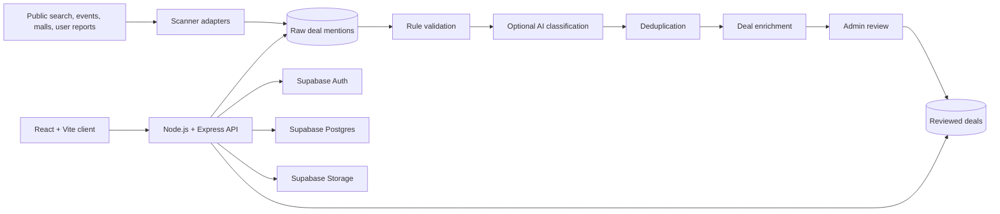
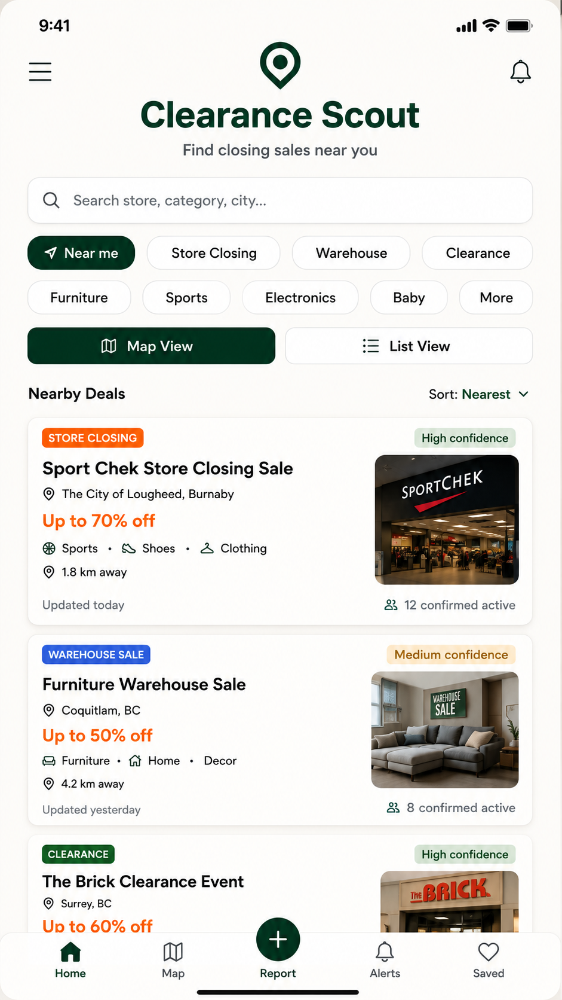
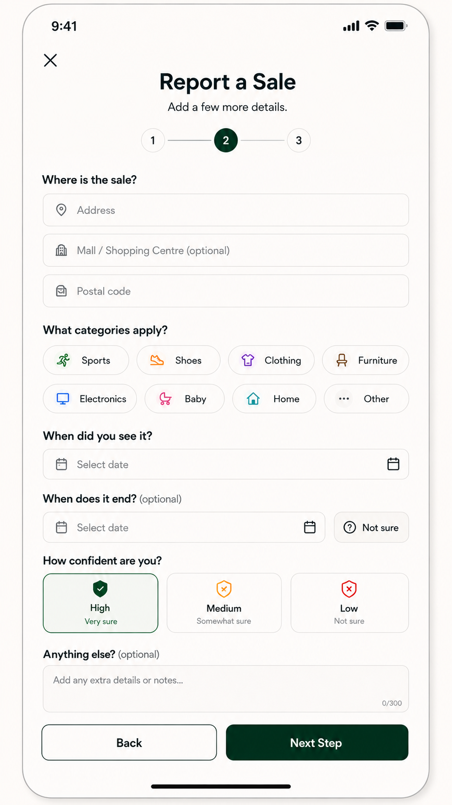

# Clearance Scout

Clearance Scout is a full-stack MVP for discovering, reporting, and reviewing local closing sales, clearance events, warehouse sales, relocation sales, and liquidation deals. It combines community submissions with an automated scanner pipeline while keeping uncertain or AI-assisted results visible for human review.

The repository includes a responsive React web application, a Node.js API, Supabase database migrations, authentication and administration workflows, optional external search providers, and an AI-assisted classification pipeline.

## Project Overview

Local clearance events are often fragmented across search results, event listings, shopping-centre pages, and community reports. The project turns those inconsistent sources into a structured workflow:

- collect public sale mentions and user-submitted deals;
- normalize source data into a shared model;
- reject stale, expired, or incomplete mentions;
- detect likely duplicate mentions and deals;
- classify and enrich useful candidates;
- hold generated candidates for administrator review; and
- publish reviewed deals for discovery, saving, alerts, and confirmation.

This is an MVP and portfolio project. It is not presented as a comprehensive or continuously operated sale-discovery service.

## Architecture



### Application layers

- **Client:** React routes, authentication context, deal discovery, saved and hidden deals, alerts, reporting, and administration screens.
- **API:** Express routes and controllers for deals, profiles, administration, scanner operations, and AI classification.
- **Business services:** classification, deduplication, enrichment, scanner orchestration, user preferences, and deal persistence.
- **Data platform:** Supabase Postgres, Auth, and Storage, provisioned through ordered SQL migrations.
- **External providers:** optional search, event, and OpenAI integrations configured through environment variables.

## Tech Stack

### Frontend

- React 18
- Vite
- React Router
- Tailwind CSS
- Leaflet
- Supabase JavaScript client
- Capacitor Android project

### Backend and data

- Node.js and Express
- Supabase Postgres
- Supabase Auth
- Supabase Storage
- OpenAI SDK
- Multer uploads

## Key Features

- Public deal browsing with category, sale-type, city, and location-oriented views
- User registration and login through Supabase Auth
- Saved, hidden, and reported deals
- User alert preferences
- Authenticated profile routes
- Administrator-only review and scanner routes
- Manual and automated deal intake
- Scanner run history and visible processing failures
- Source recency and expiration checks
- Rule-based fallback when AI classification is disabled
- AI-assisted structured classification
- Duplicate prevention before conversion
- Admin audit-log migration

## Scanner and Review Pipeline

```text
Source adapters
    ↓
Raw deal mention
    ↓
Recency and minimum-data checks
    ↓
Rule-based or AI classification
    ↓
Duplicate detection
    ↓
Structured enrichment
    ↓
Pending deal
    ↓
Human review and publication decision
```

### Collection

Scanner adapters currently cover configurable Google search, Eventbrite search, and mall/public-page sources. Scanners save source text and metadata; the AI service does not independently browse or scrape websites.

### Deduplication

Raw mentions are compared by source URL and normalized title within a city. Candidate deals are also compared using normalized title, store, city, sale type, and AI-provided duplicate hints. High-confidence duplicate matches link the mention to the existing deal instead of creating a second record.

### Enrichment

Classification output is converted into the structured deal model: store, location, sale type, category, discount text, dates, source information, summary, and confidence metadata. Missing details remain explicitly marked for verification rather than being silently treated as confirmed facts.

### AI classification and confidence thresholds

When enabled, the OpenAI integration returns structured JSON containing relevance, sale type, category, location hints, confidence, summary, review notes, and a suggested status.

The configurable thresholds are:

- `AI_AUTO_APPROVE_THRESHOLD` — default `85`;
- `AI_PENDING_REVIEW_THRESHOLD` — default `60`; and
- lower-confidence results — ignored or retained as non-publishable raw mentions.

In the current MVP, non-ignored AI candidates are normalized to `pending` before publication. The thresholds inform classification and review priority, but they do not bypass the human-review boundary.

## Engineering Decisions

- **Raw data is preserved:** collection and publication are separate stages, making classifications and failures reviewable.
- **Provider adapters are isolated:** each scanner implements its own collection logic while the shared service owns persistence and orchestration.
- **AI is optional:** the pipeline retains a deterministic rule-based fallback.
- **Uncertainty is explicit:** missing locations, expired promotions, low confidence, and ambiguous matches are held or ignored.
- **Deduplication precedes creation:** source URL and normalized business fields reduce repeated listings.
- **Admin review remains authoritative:** AI suggestions do not directly publish a deal in the current implementation.
- **Service-role access stays server-side:** privileged Supabase operations are not sent to the browser.

## Security and Privacy

- Browser authentication uses Supabase sessions.
- The API validates bearer tokens with Supabase before handling protected requests.
- Administrator routes apply a separate server-side role/email check; client-side route guards are only a usability layer.
- The Supabase service-role key is required only by the server and must never be exposed through `VITE_*` variables.
- Secrets and local environment files are excluded by `.gitignore`; only placeholder `.env.example` files are committed.
- Scanner records are based on public mentions, but source content should still be reviewed before publication.
- Uploaded content and externally supplied URLs require production hardening beyond the current MVP.

## Repository Structure

```text
.
├── client/                  # React/Vite frontend and Capacitor Android project
├── server/                  # Express API, scanners, services, prompts, and jobs
├── supabase/                # Ordered schema migrations and sample seed data
├── mock/                    # Existing product mockups used below
└── scripts/                 # Local helper scripts
```

## Running Locally

### Prerequisites

- Node.js 20 or newer
- A Supabase project
- Optional provider credentials for automated scanning and AI classification

### 1. Configure Supabase

Run the migrations in numerical order:

```text
supabase/migrations/001_initial_schema.sql
supabase/migrations/002_deal_scanner_schema.sql
supabase/migrations/003_ai_classification_schema.sql
supabase/migrations/004_user_preferences_schema.sql
supabase/migrations/005_admin_audit_log.sql
supabase/migrations/006_source_published_at.sql
```

Optionally run `supabase/seed.sql`, then create a public Storage bucket named `deal-images`.

### 2. Configure environment files

```bash
cp client/.env.example client/.env
cp server/.env.example server/.env
```

Fill in the Supabase values. Search and AI credentials are optional when the related scanner or classifier is not used.

### 3. Start the API

```bash
cd server
npm install
npm run dev
```

The API defaults to `http://localhost:4000`.

### 4. Start the frontend

```bash
cd client
npm install
npm run dev
```

Vite prints the local frontend URL.

### 5. Run scanners manually

```bash
cd server
npm run scan:deals
```

The administrator scanner interface is available at `/admin/scanner` for authorized users.

## Existing Product Mockups

These images are design mockups already stored in the repository; they are not presented as production screenshots.

### Deal discovery



### Community reporting workflow



Additional flows are available in [`mock/`](mock/).

## Tradeoffs and Limitations

- Scanner adapters depend on third-party APIs and source formats that can change.
- Rule-based deduplication is intentionally understandable but may miss semantic duplicates or produce false matches.
- AI output is validated and review-gated, but model output can still be incomplete or incorrect.
- The current scan job processes mentions sequentially and does not provide a durable queue or retry scheduler.
- Provider rate limiting, observability, automated tests, and production deployment configuration are limited.
- Administrator access can be configured by profile role or an environment allowlist; a larger system would centralize and audit role administration more rigorously.
- The committed Android project increases repository size and maintenance surface.
- Product mockups and the implemented web interface may not match in every detail.

## Future Improvements

- add unit and integration coverage for scanner, classification, and deduplication services;
- introduce a durable job queue with retries and idempotency controls;
- add provider-specific rate limiting and operational metrics;
- improve geospatial matching and duplicate review tools;
- add stronger upload validation and moderation controls;
- document Supabase row-level security policies explicitly; and
- align package and product naming consistently across the repository.

## What I Built

I implemented the React application structure, Express API, Supabase-backed data model, authentication and administration boundaries, scanner orchestration, deduplication and enrichment services, AI-assisted classification flow, confidence-based review logic, and the database migrations that support the workflow.
